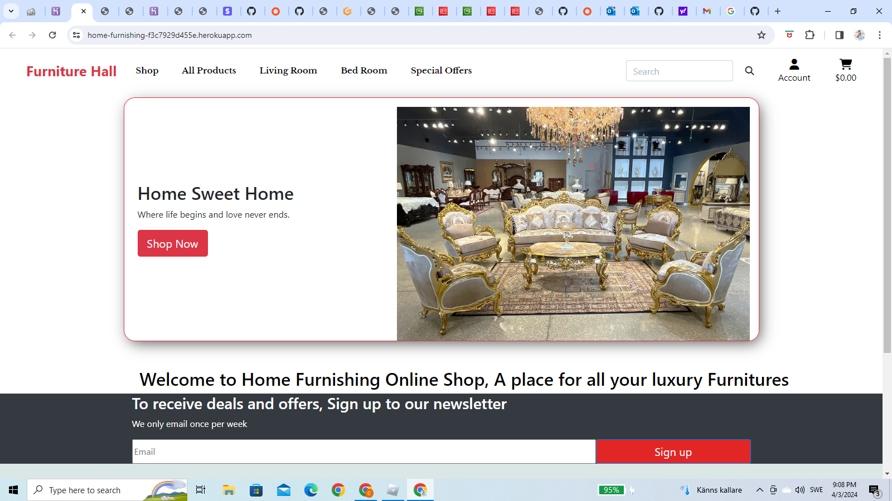
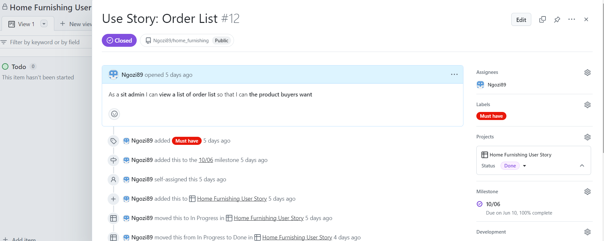
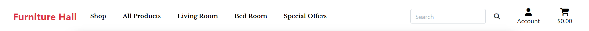
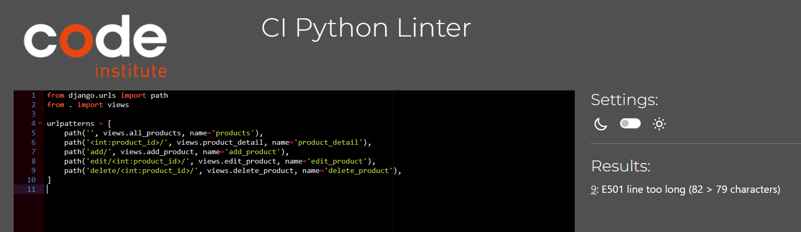

# Home Furnishing Website (Milestone Project 5)

[Home Furnishing](https://home-furnishing-f3c7929d455e.herokuapp.com/) is an e-commerce store for home furnitures. At Home Furnishing you will find brands for the modern home decoration from the comfort of your home.

## Table of contents

- [Home Furnishing](#HomeFurnishing)
  - [Table of contents](#table-of-contents)
  - [Purpose](#purpose)
- [UX Design](#ux-design)
  - [User stories](#user-stories)
    - [As a **first time user**](#as-a-first-time-user)
    - [As a **returning user**](#as-a-returning-user)
  - [UAC](#uac)
    - [Home Page](#home-page)
    - [Sign Up Page](#sign-up-page)
    - [Sign In Page](#sign-in-page)
      - [User Goal](#user-goal)
      - [Website Goal](#website-goal)
    - [Posts Page](#posts-page)
      - [User Goal](#user-goal-1)
      - [Website Goal](#website-goal-1)
    - [Product Detail Page](#product-detail-page)
    - [Create/Update Product Page](#createupdate-post-page)
    - [Delete Product Page](#delete-product-page)
      - [User Goal](#user-goal-2)
      - [Website Goal](#website-goal-2)
- [Development Plan](#development-plan)
  - [Agile design](#agile-design)
- [Design](#design)
  - [Design](#design-1)
    - [Colour Scheme](#colour-scheme)
- [Features](#features)
  - [Auth (uac 1)](#auth-uac-1)
    - [User Authentication (uac 6)](#user-authentication-uac-6)
    - [Reset password (uac 18)](#reset-password-uac-18)
  - [Responsive (uac 1)](#responsive-uac-1)
  - [Accessibility](#accessibility)
    - [Navbar (uac 3, uac 4)](#navbar-uac-3-uac-4)
    - [Message field (uac 16)](#message-field-uac-16)
  - [Admin (uac 5)](#admin-uac-5)
  - [Content Moderation (uac 15)](#content-moderation-uac-15)
  - [JS Bundling](#js-bundling)
  - [**Feature considerations**](#feature-considerations)
- [Testing](#testing)
  - [User Story Testing](#user-story-testing)
- [Deployment](#deployment)
    - [First step](#first-step)
      - [Step 2 Database](#step-2-database)
      - [Step 3](#step-3)
      - [Step 4](#step-4)
      - [Step 5](#step-5)
    - [Second step](#second-step)

## Purpose

Home Furnishing website is built using Django framework, which provides the backend functionality, such as user authentication, data management, and routing which handles the majority of the frontend. The website combines the power and flexibility of Django to deliver a smooth and responsive user experience.

Home Furnishing is a database-backed Django app for E-commerce shop. The website is created with Design Thinking and Agile approch putting myself in users position.
User story was created as a guideline in adding the website functionality

The website provides all the essential features, such as creating a personal account, searching and filtering products, the ability to add, update and delete product, selecting product to add to shopping bag, checkout, payment, email confirmation.

The website was developed as a Milestone Project#5 for the Code Institute's Full Stack Developer course.

# UX Design

## User stories

Target audiences:

- Men and women, young and old (U)

### As a **first time user**

- I want to be able to access the website from any device.
- I want to easily see product on the site and add to bag.
- I want to be able to navigate the website.
- I want to create my personal account to make a purchase.
- I want to create an account fast, but I want it to be secure.
- I want to easily access a category of products and search through them.
- I want to open a particular product to see all the details.
- I want to see the shopping bag and the total cost of the items I seleted.

### As a **returning user**

- I want to be sure my data is protected.
-
- I want the server to recognise my device so I can login without entering my information again
-
- I want to access my order details.
-
- I want the server to recognise my shipping information
-
- I want to be able to access the navbar.
-
- I want see new offers and new arrivals
-
- I want to receive special offers

- I want to be able recover my password in case I lost it.

- I want to be able to reset my password if I forget it.

## UAC

User Acceptance Criteria based on the user stories:

1. The website should be fully responsive and accessible on any device, including desktop, tablet, and mobile.

2. The website should have a clear and concise homepage that display products.

3. The website should have a clear and intuitive navigation menu that allows users to easily find and access products.

4. The website should have a registration form that allows users to create a personal account.

5. The website should have admin panel.

6. The registration process should be fast and easy, but also secure, using encryption and other security measures.

7. Each product should have a link that allows users to view it on a separate page, where they can see all the details and information about the product.

8. The website should allows registered users to login and logout.

9. Each product should have name, prize, details, image, rating if it esist

10. Product with size should have size selection.

11. The website should have a user profile to allow users see their profile

12. The website should have links to its social media pages, such as Facebook, Twitter, Instagram, etc.

13. The website should have security measures in place to protect user data, such as encryption and secure servers.

14. The website should have search engine so users can search for a pertaicular product.

15. The website should allow admins to edit and delete tproducts, if need be.

16. The website should have a password reset feature that allows registered users to reset their password in case they forget it.

17. The website should provide feedback when a user make a purchase.

### Home Page

- Displays the main purpose of the site.
- Addresses questions and doubts the first-time users might have.
- Presents opportunities for possible further actions

    #### User Goal

    > -  Understand the main purpose of the website.
    > -  Be able to signing up/in.
    > -  Easily navigate and interact with the website.
    > -  Access products.

    #### Website Goal

    > - Inform the user about the main purpose.
    > - Engage the user.
    > - Call to action.
    > - Initiate future engagement, such as going through torns and torns of product and making a purchase.
    > - Provide aesthetically pleasing user experience.

### My account Page

- Allows user to sign up/signin.

    #### User Goal

    > - Sign up.

    #### Website Goal

    >  - Allow the user to sign up easily.
    >  - Provide aesthetically pleasing user experience.

### Sign In Page

- Allows to sign in

#### User Goal

  > - Sign in.

#### Website Goal

  > - Allow the user to sign in easily.
  > - Provide aesthetically pleasing user experience.

### Posts Page

- Shows products.
- Allows users to easily find and add item to bag.
- Allows opening each product.
- Available for all users.

#### User Goal

  > - Browse the products.
  > - Easily find and access specific categories of products
  > - Open item to see them in detail.

#### Website Goal

  > - Provide a list of products.
  > - Provide comprehensive information on each product.
  > - Provide aesthetically pleasing user experience.

### Product Detail Page

- Shows a post in detail including an image.
- Allows to see select size if it has sizes.
- Allows products to be added to bag.
- Allows see details of the product
- Allows you to manage the products if you are the admin
- Available only for authenticated users.

- #### User Goal

  > - See a product in detail.
  > - See rating.

- #### Website Goal

  > - Show product detail.
  > - Allow the user to select product .
  > - Provide aesthetically pleasing user experience.

### Create/Update delete Page

- Creates a new product.
- Allows updating an existing product.
- Allows deleting a products.
- Available only for authenticated users.

- #### User Goal

  > - Create a new product.
  > - Update your products.

- #### Website Goal

  > - Allow the user to create/update a products.
  > - Provide aesthetically pleasing user experience.

### Delete products Page

- Confirms if the user wants to delete their product.
- Available only for authenticated users.

#### User Goal

  > - Delete a products.

#### Website Goal

  > - Confirm with the user deletion of the products.
  > - Provide aesthetically pleasing user experience.

### Footer ([uac 11](#uac11), [uac 12](#uac12), [uac 20](#uac20))

# Development Plan

## Agile design

The development of the website has followed an Agile methodology, using GitHub's projects to prioritize and track user stories and features. The approach enabled the implementation of ideas based on their level of importance, ensuring that the website functionality and user experience were not compromised. The following categories were applied

- must have
- should have
- would have
- could have

# Design

## Design

The website is meant to have a simple layout and a clean design. The home page is aimed at giving a professional and informative impression.

### Colour Scheme

The colour scheme is simply black and white to create a visually appealing and cohesive design that is easily recognizable as being associated to shopping websites.

# Features

## Auth ([uac 1](#uac1))

Authentication is particularly important for user who wants to purchase products as the subject is quite sensitive and people are vulnerable asking for help, so it should be confidential within the community and available only for authenticated users. Thus the website has account fixed at the top.

In a Django project, there are several ways to handle authentication and authorization. One of the most popular libraries [django-allauth](https://django-allauth.readthedocs.io/en/latest/), provides a flexible solution for handling user authentication and registration. It supports both traditional username and password authentication as well as social authentication through providers like Google, Facebook, and Twitter. It uses session-based authentication and stores user authentication information in the user's session, instead of Django's built-in token-based authentication. When a user logs in, the library creates a new session for the user and stores the user's identifying information (such as the user's ID or username) in the session. The library then sends a session ID to the client, as a session cookie, which the client stores in the browser. With each subsequent request, the client sends the session ID back to the server in the Cookie header of the HTTP request. django-allauth then uses the session ID to look up the associated session and authenticate the user.

One of the key features of [django-allauth](https://django-allauth.readthedocs.io/en/latest/) is its support for OAuth. OAuth is an open standard for authorization that allows users to share their private resources stored on one site with another site, without having to share their credentials. OAuth allows users to grant a third-party application access to their resources without having to reveal their password. This is useful for scenarios where users want to give access to their resources to a third-party application without having to provide their credentials.

One of the main reasons I chose to use [django-allauth](https://django-allauth.readthedocs.io/en/latest/) is because of its flexibility and support for various authentication methods. Another reason is because of its scalability. The library is built on top of the Django framework and it is actively maintained and widely used in production, which means that it is likely to be compatible with the latest Django versions and have a solid user base.

### User Authentication ([uac 6](#uac6))

The project uses Django's built-in User model, which means that users can register and log in to the website with email, username. However, users will not be logged in automatically after resetting their password. The ACCOUNT_SESSION_REMEMBER is set to True which means that the session will be remembered even if the user closes the browser.

### Reset password ([uac 18](#uac18))

The website also provides a password reset feature, which is an important security feature that allows users to reset their password if they have forgotten it or if their account has been compromised.

## Responsive ([uac 1](#uac1))

Befit website is designed with flexibility and aesthetic appeal in mind, ensuring that it is responsive and visually pleasing on all screen sizes and resolutions, starting at 350px.
Responsiveness was achieved by utilizing Bootstrap. This allowed for the rearrangement of page components to optimize the user experience on different screen sizes. Breakpoints were chosen based on typical device screen sizes and the goal of providing the best possible presentation of content for all screens. Breakpoints are not strictly consistent (\*particularly for smaller screens) but it is done intentionally to provide a better presentation of the content for all screens.

## Accessibility

The website is designed and developed with accessibility in mind: it provides alternative text for images, using semantic HTML elements, aria-labels and providing adequate colour contrast. Keyboard navigation is possible. It also works with screen readers, however, there's room for improvement in this aspect, to ensure that it is fully accessible to users with disabilities.

### Navbar ([uac 3](#uac3), [uac 4](#uac4))

The navbar is a key feature of the website, located at the top of the page. It also include links that aid navigation on the website. The "Registration" link provides form for new users to register and the login allows already registered users to login. The "Login" and "Register" links are used for user authentication and are only visible to unauthenticated users. Once the user logs in, they will not see these links anymore and "Log out" will be displayed instead.

## Admin ([uac 5](#uac5))

The website includes a fully customised Admin panel. The admin panel allows for the management and editing of the application's data through a web interface. This interface is only accessible to users with administrator or superuser privileges. The admin panel provides CRUD functionalities. It allows for the management of the products, users, groups, and permissions.

## JS Bundling

JavaScript bundling is an optimization technique we can use to reduce the number of server requests for JavaScript files. Webpack is a JavaScript bundler that allows to package and optimize JavaScript code for production use. It takes multiple JavaScript files, and any other assets such as images or CSS, and creates a single bundle that can be loaded by the browser. This bundle includes all the code your application needs to run, and it can also optimize the code for faster load times and better performance.

In the project before bundling the code was compiled with Babel, a JavaScript transpiler that allows to write modern JS code and then converting it to a version that is compatible with older browsers. For this reason, the main JS file that handles Django app was also bundled.

## **Feature considerations**

1. Allow users to save product and make purchase later

2. Social media links for users to follow and see more deals

3. Allow users leave a reveal on product they purchased.

5. Buttons to share posts on social media.
Buttons that provide the ability for users to share products on social media allow for an increase in the reach and visibility of the website. This can lead to more traffic to the website and ultimately more purchase. The buttons make it easy for users to share content with their friends and followers on social media.
When content is shared on social media, it includes a link back to the website. This can help with branding, as it increases the visibility of the website and its content, increasing positive impact.

# Testing

## User Story Testing

| Expectations                                                                                 | Realisation                                                                                                                                                                                                                                                                                                                                                                                                                          |
|----------------------------------------------------------------------------------------------|--------------------------------------------------------------------------------------------------------------------------------------------------------------------------------------------------------------------------------------------------------------------------------------------------------------------------------------------------------------------------------------------------------------------------------------|
| As a **first time user**                                                                   |                                                                                                                                                                                                                                                                                                                                                                                                                                      |
| I want to be able to access the website from any device. | The website is fully responsible and accessible on all screen sizes, starting at 350px.|
| I want to easily understand the main purpose of the site and see products.                           | The Home page concisely and comprehensively introduces the issue.                       |
| I want to be able to easily navigate and find deals.  | 1. The navbar is present on the screen and allows for navigating the website.               |
| I want to create my personal account to place an order.                                                                     | The user can register a new account.                                                            |                                                                                                             |
| I want to create an account fast, but I want it to be secure.                                                  | 1. Authentication is handled by Allauth.                                      |
| I want to easily access a category of products I need and to be able to search through them.               | 1. Products are displayed ones user click shop now webpage.                                                                                                                                    |
| I want to open a product on a separate page to see all the details.                                                              | Products could be opened on a separate page to view them in detail.                                                                                                      |                                                                          ||
| I want to be able to checkout after selecting items.                   | "checkout" button is available on the checkout page and every user see the shopping back and click on it to checkout.                                                                                                 |                                                                                                                                                 |
|  As a **frequent user**                                                                               |                                                                                |
|  I want to be sure my data is protected.          | The app is secured.                                                              | 
                        |        |

## Manual Testing

I have tested this project code by
- Pasting the code on PEP8 linter and no error found.
- Tested after deployment on Code Institute Heroku terminal and it run successfully.

### Landing page

- Home page.
- The application is hosted on - <https://heroku.com/>
- Database - <https://elephantsql.com/> was used as external database
- Heroku PostgreSQL is used to store the blog posts, comments and likes.
- Cloudinary is used to stor blog's images

# Deployment

This project was deployed using Code Institute's mock terminal for Heroku and the steps for deployment are as followed:

### First step

- Sign in to Heroku app
- Create a new app with a unique name

#### Step 2 Database

- Create account on ElephantSQL.com and create new instance
- Select a plan name and choose tine turtle (free)
- Select region and review to make sure everthing is setup correctly
- Click create instance at the down right side of your windown.
- Click on the database you just created and cope the URL
- On the IDE in codeanywhere create a file env.py, then import os and create os.environ with DATABASE.URL variable and set the copied url from as the value.
- Create another os.enviro and set the variable SECRET_KEY and create your sectret key

#### Step 3

- Open setting.py and import os at the top then add the database url, add the env.py file, scroll down and change the secret key value to os.environ.get('SECRET_KEY')
- Make sure the env.py file is on gitignore so it won't be commited to github.
- You can use git status to check which files that will be commited to github and make sure the env.py file is not amoung.
- Comment out the existing DATABASE on setting.py and create another Database and set it to
     'default': dj_database_url.parse(os.environ.get("DATABASE_URL"))

#### Step 4

- When this is done migrate to see everthing is okay, then return to Heroku and
- Go to setting and reveal _Config Var_. Add a new key clalled DATABASE_ URL and the value will be the copied url database created earlier.
- Add another config var key SECRET_KEY and paste the secret key that's added on the env'py file.

### Second step

- Click on deploy at the top left side and select github to connect to github. Confirm your connection to github and search for the github repository name, click connect to link up the Heroku app creacted ealier with the repository.
- Choose either automatic deploy or manual. I used manual which is deploy branch.
- Allow the app to build until it shows successful then click view and it takes you to the deployed link.

# Note
- I Icouldn't attach photos because the website broke after deployment